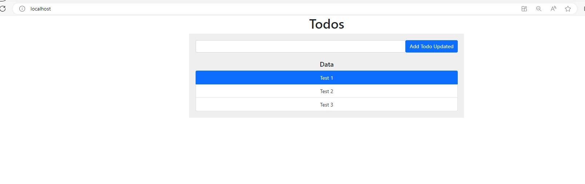

# SD2411 Infrastructure
## Reference Repositories
| Repository | Description |
|--|--|
|[sd2411_msa](https://github.com/sieunhantanbao/sd2411_msa)|**Application source code**. This contain a backend, frontend and use the mongo as database|
|[sd2411_devops_ci](https://github.com/sieunhantanbao/sd2411-devops-ci)|This contains the **Jenkins Groovy files** (Jenkins Shared Library). When the [sd2411_msa](https://github.com/sieunhantanbao/sd2411_msa) has changed the source code, it will call the Jenkins files in this repo to build the source code (CI process)|
|[sd2411_helm_charts](https://github.com/sieunhantanbao/sd2411-helm-charts)|This contains the **helm charts** definition and helm chart packages (manifest) to deploy the apps from the [sd2411_msa](https://github.com/sieunhantanbao/sd2411_msa)|
|[sd2411_azure_infrastructure](https://github.com/sieunhantanbao/sd2411-helm-charts)|**Ops source code**. This contains the infrastructure as code (iac) to provision the Azure resources with terraform. This also handles the Continue Deployment (CD) with ArgoCD|
## Overview
 
## Key Features
- Provision the Azure Kubernetes Service (AKS), Azure Container Registry (ACR), Virtual Machine (VMs) by terraform scripts.
- Install and setup Jenkins, Prometheus and Grafana.
- Handle Continues Deployment process with ArgoCD.
## Prerequisite Tools
- [Azure Command-line Interface (CLI)](https://learn.microsoft.com/en-us/cli/azure/install-azure-cli)
- [Kubectl CLI](https://kubernetes.io/docs/tasks/tools/)
- [Terraform CLI](https://developer.hashicorp.com/terraform/tutorials/aws-get-started/install-cli)
## Infrastructure set up
### Provision Azure Kubernetes Service (AKS)
- Change directory (cd) to iac/terraform/aks/ha: `cd iac/terraform/aks`
- Modify the variables in the `variables.tf` file to match your requirements.
- Run the below commands
	- `terraform init`
	- `terraform plan --out tfplan.out`
	- `terraform apply tfplan.out`
### Provision Azure Container Registry (ACR)
- Change directory (cd) to iac/terraform/aks/acr: `cd iac/terraform/acr`
- Modify the variables in the `variables.tf` file to match your requirements.
- Run below command
	- `terraform init`
	- `terraform plan --out tfplan.out`
	- `terraform apply tfplan.out`
### Provision Virtual Machine (VMs)
This will provision an Ubuntu VM with **Docker** and **Jenkins** installed
- Change directory (cd) to iac/terraform/aks/vm: `cd iac/terraform/vm`
- Modify the variables in the `variables.tf` file to match your requirements.
- Run below command
	- `terraform init`
	- `terraform plan --out tfplan.out`
	- `terraform apply tfplan.out`

<u>Note:</u> The script to install **Docker**, **Jenkins**, **Trivy**, and **Kubectl** can be found in `iac/terraform/vm/azure-user-data.sh`

## Software/Tools setup
### Install ArgoCD (with helm support enable)
- Get AKS credential: `az aks get-credentials --resource-group <your_resource_group_name> --name <your_aks_cluster_name>`
- Create argocd namespace: `kubectl create namespace argocd`
- Navigate to `cd tools/argocd`, run this command `kubectl apply -n argocd -f install-argocd.yaml`
- Edit argocd-server to change (ClusterIP to LoadBalancer): `kubectl edit svc argocd-server -n argocd`
- Get ArgoCD password (username: admin): `kubectl -n argocd get secret argocd-initial-admin-secret -o jsonpath={.data.password} | base64 -d`
- Login to ArgoCD by the External IP (URL) from the argocd-server service: `kubectl get svc argocd-server -n argocd`

### Install ArgoCD Image Updater
- Navigate to `cd tools/argocd-image-updater` and run this command: `kubectl apply -f 0-install-argocd-image-updater.yaml`
- Create docker registry secret `azure-container-secret` in `agrocd` namespace. This is to allow the Argo CD Image Updater to pull the docker images from the ACR. Please refer here to create a new Service Principal for the ACR: [Pull images from an Azure container registry to a Kubernetes cluster using a pull secret](https://learn.microsoft.com/en-us/azure/container-registry/container-registry-auth-kubernetes). This will allow the helm to pull the images from the ACR: 
    `kubectl  create  secret  docker-registry  azure-container-secret 
    		--namespace  agrocd 
			--docker-server=<container registry name>.azurecr.io 
			--docker-username=<Service principal ID>
			--docker-password=<Service principal password>`
### Install Argo Rollouts and Kubernetes Plugin (kubectl argo rollout) (to support Blue/Green deployment strategy)
Please refer to this link [Argo Rollouts](https://argo-rollouts.readthedocs.io/en/stable/installation/) for the detail of the installation.
### Setup Prometheus and Grafana (monitoring)
Navigate to `cd tools/monitoring` and run this command `sh install-monitoring-tools.sh`. For more details, please visit [HERE](https://techcommunity.microsoft.com/t5/apps-on-azure-blog/using-azure-kubernetes-service-with-grafana-and-prometheus/ba-p/3020459).

### Setup Jenkins on Virtual Machine
The step **Provision Virtual Machine** has already installed a Jenkins. Please refer to [How To Install Jenkins on Ubuntu 22.04](https://www.cherryservers.com/blog/how-to-install-jenkins-on-ubuntu-22-04) **(starts from step #6: Set up Jenkins)**. 
While setup the Jenkins, please make sure the plugins below get installed
- Jenkins suggested plugins
- Docker PipelineVersion
- Pipeline Utility Steps
- HTML Publisher
## Deploy application with ArgoCD
### Deploy application
- Change directory (cd) to argocd/helm/{environment_name} (i.e. `cd argocd/helm/qa`) and run the below commands
	- Deploy the Azure Container Registry (ACR) secret. Please refer here to create a new Service Principal for the ACR: [Pull images from an Azure container registry to a Kubernetes cluster using a pull secret](https://learn.microsoft.com/en-us/azure/container-registry/container-registry-auth-kubernetes). This will allow the helm to pull the images from the ACR.
		- `kubectl create ns qa`
		- `kubectl  create  secret  docker-registry  qa-acr-secret  \ --namespace  qa  \
--docker-server=<container registry name>.azurecr.io  \
--docker-username=<Service principal ID>  \
--docker-password=<Service principal password>`
	- Deploy database: `kubectl apply -f 1-postgres.yml`
	- Deploy backend: `kubectl apply -f 2-backend.yml`
	- Deploy frontend: `kubectl apply -f 3-frontend.yml`

## Manage the application on the ArgoCD UI
### Demonstration screenshot
- ArgoCD UI   
- Frontend-qa application (`kubectl port-forward service/frontend 80:3000 -n qa`)   
- ArgoCD UI (multiple environments)   